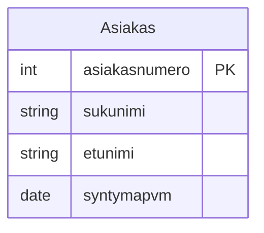
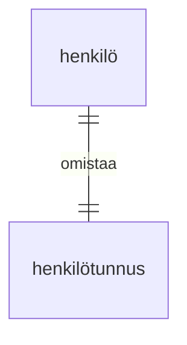
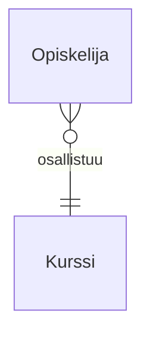
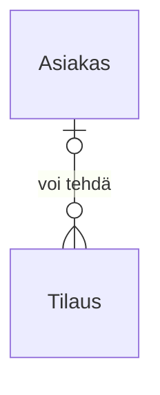
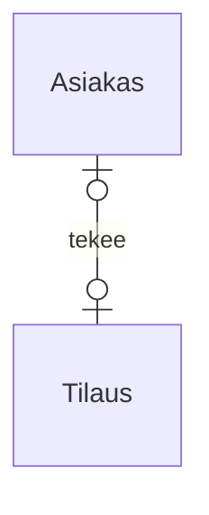
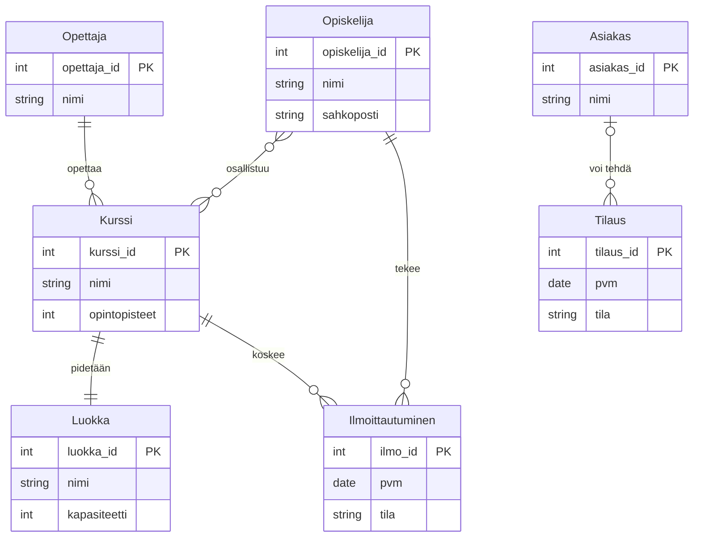
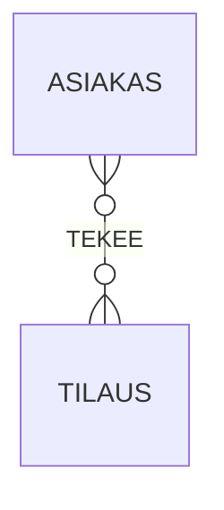
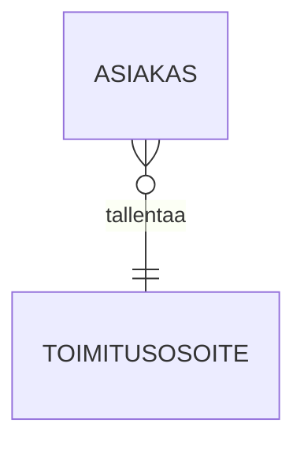
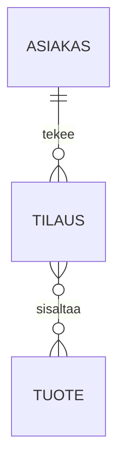

# Entiteettien sidostyypit:

## 1. One-to-One, 1-1
* Molemmat osapuolet esiintyvät vain kerran suhteessa toisiinsa




## 2. One-to-Many, 1-N
* Ensimmäinen entiteetti voi liittyä moneen toiseen, mutta toinen vain yhteen
* `Opettaja ||--o{ Kurssi : "opettaa"`


# 3. Many-to-Many, N-M
* Molemmat voivat liittyä moneen toiseen. 
* Toteutetaan usein liitostaululla (junction entity) 
* **`Opiskelija }o--o{ Kurssi: "osallistuu"`**



# 4. valinnainen 0..1–N tai 0..n
* Käytetään, kun suhde ei ole pakollinen toiselle osapuolelle
* **`Asiakas o|--o{ Tilaus : "voi tehdä"`**


# 4. valinnainen 0..1–N tai 0..n
* Käytetään, kun suhde ei ole pakollinen toiselle osapuolelle



# ERD-esimerkki: sidostyypit Mermaidilla





```mermaid
Diagram 
    Henkilo ||--|| Passi : "omistaa"
```

```mermaid
    KESAMOKKI {
        int id PK
        string osoite
    }
```


```mermaid
| vasen | oikea | suomeksi    | englanniksi | Crow’s Foot (vasen) | Crow’s Foot (oikea) |
|------:|:------|-------------|-------------|--------------------|---------------------|
|   1  |   1    | Yksi yhteen | One to one |Kurssi pidetään Luokassa || | || |
|   1  |   N    | Opettaja opettaa Kurssia | A Teacher teaches Courses | || | o{ |
|   N  |   M    | Opiskelija osallistuu Kurssille | A Student enrolls in Courses | o{ | o{ |
| 0..1 |   N  | Asiakas voi tehdä Tilauksen | A Customer may place Orders | o| | o{ |
```


https://mermaid.js.org/syntax/entityRelationshipDiagram.html


=======
| Viiva | Merkitys  | Esimerkki                         |
|-------|-----------|-----------------------------------|
| `||--||` | 1–1    | Kurssi pidetään Luokassa          |
| `||--o{` | 1–N    | Opettaja opettaa Kurssia          |
| `}o--o{` | N–M    | Opiskelija osallistuu Kurssille   |
| `o|--o{` | 0..1–N | Asiakas voi tehdä Tilauksen       |
```




```
| Koodi   | Kardinaliteetti | Selitys                    |
|---------|-----------------|----------------------------|
| `\|\|`  | 1               | yksi ja vain yksi          |
| `o\|`   | 0..1            | nolla tai yksi             |
| `}`     | 1..M            | yksi tai monta, ei nollaa  |
| `}o`    | 0..M            | nolla tai monta            |
```

```
| Koodi            | Suhde    | Selitys                                  |
|------------------|----------|-------------------------------------------|
| `\|\|--\|\|`     | 1–1      | yksi suhde yhteen (molemmat päät 1)       |
| `\|\|--}o`       | 1–0..M   | yksi suhteessa nollaan tai moneen         |
| `\|\|--}`        | 1–1..M   | yksi suhteessa vähintään yhteen          |
| `o\|--\|\|`      | 0..1–1   | valinnainen yksi suhteessa yhteen        |
| `o\|--}o`        | 0..1–0..M| valinnainen yksi suhteessa nollaan/moneen|
| `}o--}o`         | 0..M–0..M| moni–moni, nolla tai monta molemmissa     |
| `}--}`           | 1..M–1..M| moni–moni, ei nollaa kummassakaan         |

```