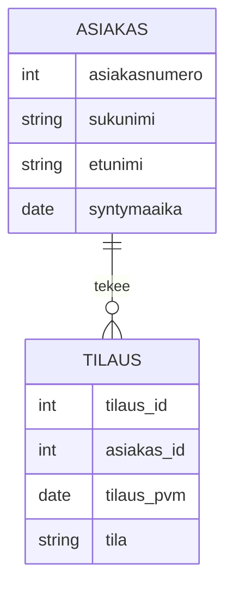
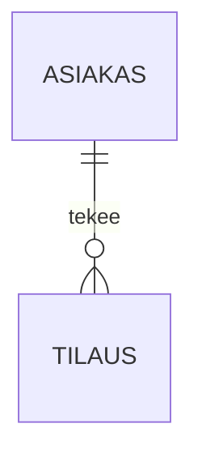
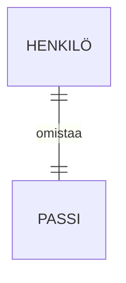

```mermaid
erDiagram
    ASIAKAS {
        int asiakasnumero
        string sukunimi
        string etunimi
        date syntymaaika
    }

    TILAUS {
        int tilaus_id
        int asiakas_id
        date tilaus_pvm
        string tila
    }

    ASIAKAS ||--o{ TILAUS : tekee
```

```mermaid
erDiagram
    ASIAKAS {
    }

    TILAUS {
    }

    ASIAKAS ||--o{ TILAUS : tekee
```

```mermaid
erDiagram
    TYÖNTEKIJÄ {
    }

     {
    }

    OSTOS ||--o{ TILAUS : tekee
```

```mermaid
erDiagram
    HENKILÖ {
    }
    PASSI {
    }

HENKILÖ ||--|| PASSI : "omistaa"
```