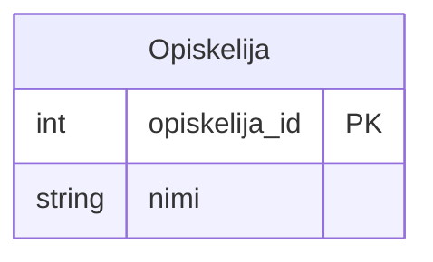
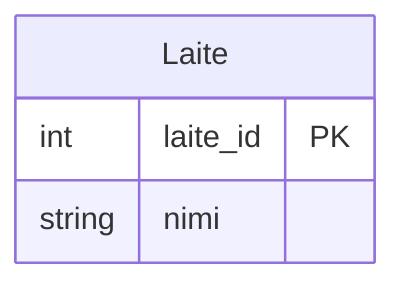
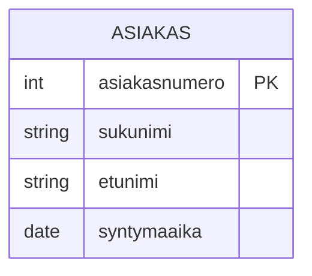
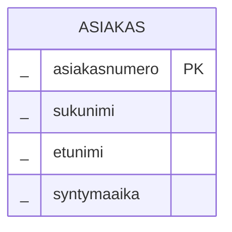

## Diagrammi A

```mermaid
erDiagram
    Opiskelija {
        int opiskelija_id PK
        string nimi
}
```

```mermaid
erDiagram
    Laite {
        int laite_id PK
        string nimi
    }
```

```mermaid
erDiagram
    ASIAKAS {
        int asiakasnumero PK
        string sukunimi
        string etunimi
        date syntymaaika
}
```

```mermaid
erDiagram
    ASIAKAS {
        _ asiakasnumero PK
        _ sukunimi
        _ etunimi
        _ syntymaaika
}
```

