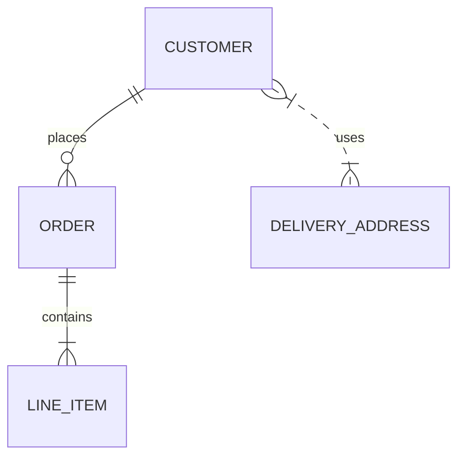
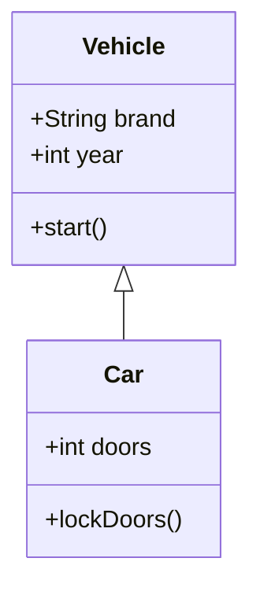
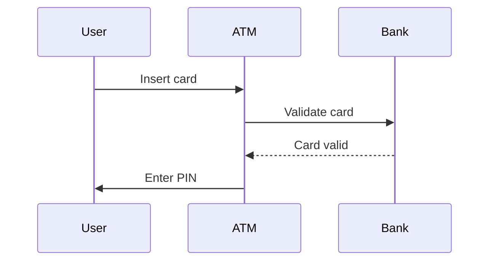
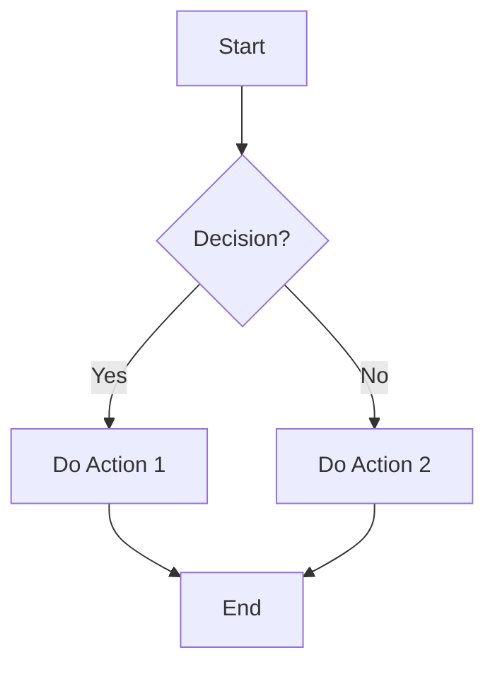
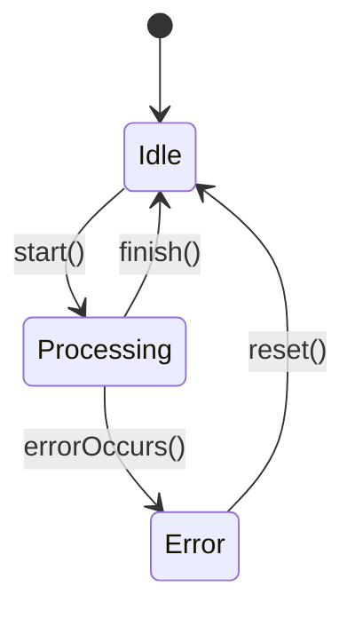
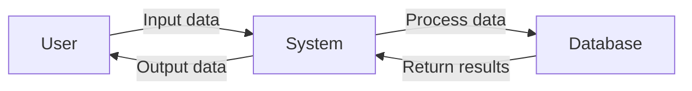

# Ohjelmoinnin olennaiset kaaviot

Tässä Markdown-esimerkissä esitellään ohjelmoinnin kannalta tärkeimmät kaaviot yksinkertaisin esimerkein.

---

## 1. ERD (Entity-Relationship Diagram)

*Selitys:* `CUSTOMER` voi tehdä monta `ORDER`-tilausta, `ORDER` sisältää useita `LINE_ITEM`-rivikohtia, ja asiakas voi käyttää useita toimitusosoitteita.

---

## 2. UML Luokkakaavio

*Selitys:* `Car` perii `Vehicle`-luokan ominaisuudet ja metodit.

---

## 3. Sekvenssikaavio

*Selitys:* Näyttää käyttäjän ja pankkiautomaatin välisen viestinnän.

---

## 4. Aktiviteettikaavio

*Selitys:* Kuvaa yksinkertaisen päätöksen ja toimintojen kulun.

---

## 5. Tilakaavio

*Selitys:* Kuvaa olion mahdolliset tilat ja siirtymät.

---

## 6. Data Flow Diagram (DFD)

*Selitys:* Näyttää datan virtauksen käyttäjän, järjestelmän ja tietokannan välillä.

---

### Yhteenveto
- ERD: tietokannat
- Luokkakaavio: olio-ohjelmointi
- Sekvenssikaavio: prosessien vuorovaikutus
- Aktiviteettikaavio: algoritmin logiikka
- Tilakaavio: olion tilat
- DFD: datan kulku
