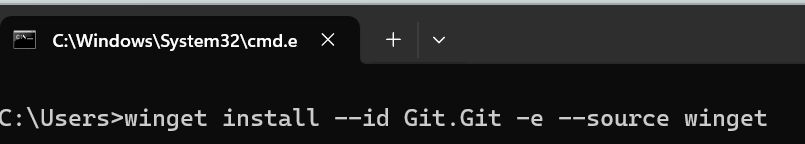

---
# GIT:n asennus Wingetillä

Tässä ohjeessa kerrotaan, miten Git asennetaan Wingetillä. Gitin voi asentaa myös muilla tavoilla, mutta tämä on nopein ja yksinkertaisin tapa.

## 1. Siirry ensin komentokehotteeseen. 


## 2. Anna komento


Huom. Jatkossa komentokehotekoodi näytetään näin:
```powershell
winget install --id Git.Git -e --source winget
```

## 3. Jos joskus git-ohjelman päivitystä, tapahtuu se komennolla:
```powershell 
winget upgrade Git.Git
```


## Mitä nyt sitten?
Nyt sinulla on käytössäsi työkalu, jolla hallitset tiedostoja ja työskentelet tiimissä koodin versioiden kanssa.
Git ohjaa järjestelmälliseen toimintaan, mikä helpottaa varsinkin pidempien projektien hallintaa.

Git ohjaa järjetelmälliseen toimintaan muutenkin - tai se voi sen tehdä. Sen voi sanoa, että järjestelmällinen toiminta helpottaa. Tässä vaiheessa tämä liittyy erityisesti siihen, mihin ohjelmistot talletaan.


## Mihin koodikansiot kannattaa laittaa?

**Lyhyesti**: valitse yksi “juurikansio”  omille koodeillesi (esim. D:\koodi tai C:\Users\<sinä>\codes) ja pidä kaikki koodit ja tulevat git-projektit sen alla.
Älä käytä pilvisynkattuja kansioita (OneDrive/Dropbox/Google Drive) aktiiviselle koodisisällölle.

# Yksi mahdollinen kansiorakenne 
```makefile
D:\koodi\
          \personal\
          \work\
          \school\
          \archived\
          \scratch\
```

**Nimeämisohje**: älä käytä  välilyöntejä, käytä __kebab-casea__: `my-app-backend`, `excel-tools`, `course-2025-spring`.


## Gitin perusasetukset
Näillä komennoilla voit virittää git:iä.  Anna komennot komentotilassa.

```powershell
# Määritetään käyttäjän nimi, joka näkyy kaikissa commit-viesteissä. 
# Tämä nimi tulee aina commit-historian tekijäksi.
git config --global user.name  "Etunimi Sukunimi"

# Asettaa sähköpostiosoitteen commit-historian tekijätietoon.
# Käytä samaa osoitetta jota käytät GitHubissa
# silloin commitit yhdistyvät selkeämmin profiiliisi
git config --global user.email "sinä@example.com"

# Kun luot uuden repositorion (git init), 
# sen oletushaarana on main (vanhoissa ympäristöissä tämä oli "master").
git config --global init.defaultBranch main

# Windowsissa tiedostonimien polkupituus on joskus rajoitettu (260 merkkiä).
# Tämä asetus sallii Gitin käsitellä pidempiä polkuja.
# Tarpeellinen etenkin monimutkaisissa Node.js / JavaScript -projekteissa, 
# joissa riippuvuuskansiot voivat olla todella syviä.
git config --global core.longpaths true

# Tämä liittyy rivinvaihtomerkkeihin:
# Windowsissa rivinvaihto on CRLF (\r\n), Linux/Unix/WSL:ssä LF (\n).
# (CR: carriage return, "vaununpalautus". LF: "line feed", rivin vaihto)
# true tarkoittaa: kun lisäät tiedoston repoosi, Git muuntaa rivinvaihdot LF-muotoon 
# (versionhallintaan tallennetaan yhtenäinen muoto). 
# Kun haet tiedostot takaisin koneelle, Git muuttaa ne Windows-tyyliseksi CRLF:ksi.
git config --global core.autocrlf true
```

# GIT- termejä lyhyesti

* **GitHub**: Verkkopalvelu, joka tarjoaa Git-versionhallintaan pilvitallennuksen ja yhteistyötyökalut.
* **Repository (repo)**: Projektin "kansio", jossa on kaikki tiedostot ja niiden historiat Gitillä hallittuna.
* **Commit** : Tallennuspiste: paketti muutoksia tiedostoihin + viesti, joka jää historiaan.
* **Push** : Lähettää paikalliset commitit etärepositorioon (esim. GitHubiin).
* **Pull** : Hakee uudet muutokset etäreposta ja yhdistää ne omaan paikalliseen versioon.
* **git add** : Lisää muutokset staging-alueelle, valmistaa ne commitointia varten.
* **Remote** : Etärepositorio, esim. GitHubissa sijaitseva kopio projektistasi.

# Ensimmäiset toimet

## 1. Uuden paikallisen repon luonti (ja kytkentä GitHubiin)

Muista koodikansion perusrakennet:

```makefile
\koodi (tai joku muu nimi)\
        \personal\
        \work\
        \school\
        \archived\
        \scratch\
```


* (jos et ole vielä komentotilassa... )
Siirry repokansioon. 
  * Voit käyttää Windowsin Tiedostohallintaa (File Explorer).
  * tai siirtyä sinne komentotilassa (CD ... Cd.. )
* Perusta tuohon kansioon uusi kansio. Anna sille nimeksi vaikka **personal**.
```makefile
D:\repos\
          personal
```
* Siirry perustamaasi kansioon Tiedostohallinnalla. 
  * tai komentotilassa ```cd personal```
* Kirjoita Tiedostohallinnan osoiteriville (siellä yläreunassa) teksti ``CMD``. Paina ENTER.
* Olet ns. komentotilassa. 
* Varmista, että olet tuosa aiemmin tekemässäsi kansiossa.

huom. voit tehdä tuon edellämainitun kokonaan komentotilassa:
```powershell
d:             rem siirtyy levyasemalle d
\repos\        rem jos kansio on juuressa, siirtyy repos- kansoon
mkdir personal rem tekee kansion nimeltä personal
cd personal    rem siirtyy kansioon personal
```

## Repon eli repositoryn luominen
* muuta tekemäsi kansio repositoryksi eli repoksi. Voi sanoa "git-kansioksi". 
* Kirjoita komentitilassa:

Harjoitus 1: Alusta repository ja tee ensimmäinen commit:

```powershell
git init -b main                    rem tee kansiosta repo(sitory)
echo "# my-project" > README.md     rem muodosta tiedosto README.md
echo "dist/" > .gitignore           rem muodosta tiedosto .gitignore
git add .                           rem lisää repoon tiedostot odottamaan jatkolähetystä
git commit -m "chore: initial commit" rem tee tiedostoista commit
```
Harjoitus 2: Hae omaan koneeseesi repository. 

```powershell
siirry takaisin repos- kansioon
tee uusi 
git remote add origin https://github.com/<käyttäjä>/my-project.git
git push -u origin main
```

## Olemassa olevan repon kloonaus

Valitse oikea alikansio repojuuren alta ja kloonaa:

```powershell
cd D:\repos\personal
git clone https://github.com/<käyttäjä>/some-repo.git
cd some-repo
```

## Do & Don’t

✅ Tee
* Pidä kaikki reposi yhden selkeän juuren alla.
* Pidä polut lyhyinä, nimet selkeinä.
* Pushaa GitHubiin/GitLabiin varmistukseksi.
* Erota aktiiviset ja arkistoidut (archived/).

❌ Älä tee
* Älä pidä repoja OneDrive/Dropbox-kansioissa.
* Älä sekoita samaan repojuureen tilapäisiä jättitiedostoja (iso media → harkitse Git LFS:ää).
* Älä tee “monoprojektirepoa” vahingossa – yksi projekti = yksi repo on usein selkein.
