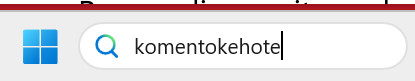
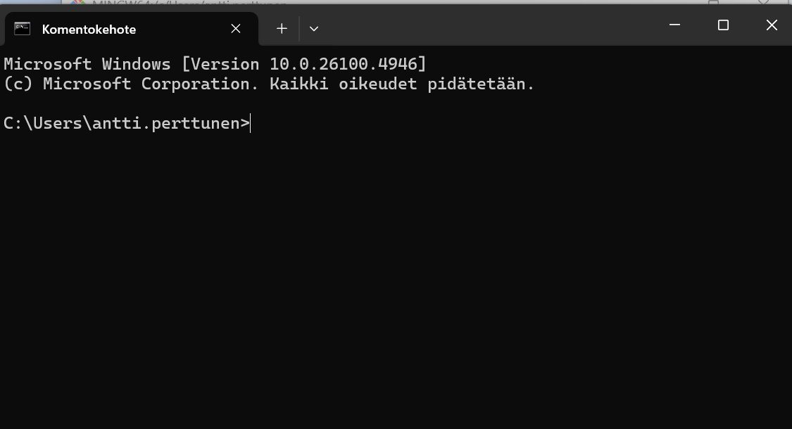
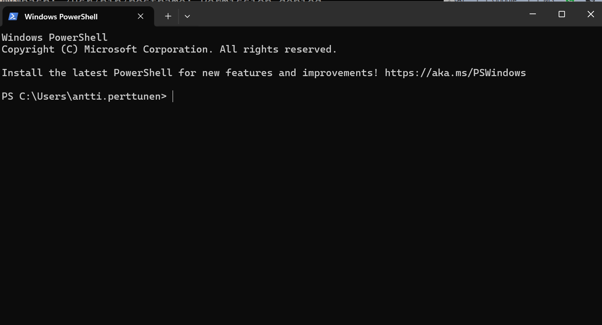
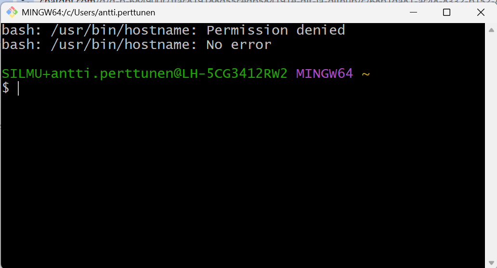

# GIT- tilanteita

Jos ohjeen jossain kohdassa ohjeita on tähti ( ⭐ ), voit hypätä sen halutessasi ohi.

Nämä ohjeet kuvaavat vain yhden tavan tehdä näitä toimenpiteitä. Monesti on muitakin tapoja.

Laatikoissa olevat koodit annetaan komentotilassa. 


Näissä ohjeissa toistuu sana __repo__. Se tarkoittaa __repositoryä__<br>
Repository on tavallaan kasnio, jossa prejektin tiedostot on talletettu. Se voi olla paikallinen, sinun koneellasi tai etärepo, esim. GitHubissa.

- [GIT- tilanteita](#git--tilanteita)
  - [1. Miten luon SSH- salausavaimen työasemani ja GitHubin välille?](#1-miten-luon-ssh--salausavaimen-työasemani-ja-githubin-välille)
  - [2. Mitä on komentotila ja onko sitä pakko käyttää?](#2-mitä-on-komentotila-ja-onko-sitä-pakko-käyttää)
  - [3. Miten kansiot ja repot kannattaa nimetä?](#3-miten-kansiot-ja-repot-kannattaa-nimetä)
  - [4. Minulla on tavallinen kansio (ei vielä repo), haluan siitä repositorion GitHub:iin.](#4-minulla-on-tavallinen-kansio-ei-vielä-repo-haluan-siitä-repositorion-githubiin)
  - [5. Voi ei, klikkasin Add Readme / .gitignore / License!!](#5-voi-ei-klikkasin-add-readme--gitignore--license)
  - [6. Sain virheilmoituksen "Committing is not possible because you have unmerged files"](#6-sain-virheilmoituksen-committing-is-not-possible-because-you-have-unmerged-files)


## 1. Miten luon SSH- salausavaimen työasemani ja GitHubin välille?
Joskus tämä tehdään jo asennusvaiheessa. Sen voi kuitenkin tehdä jälkeenikin päin.
   ```bash
   ssh-keygen -t ed25519 -C "oma.nimi@oppi.luovi.fi"
   ```

## 2. Mitä on komentotila ja onko sitä pakko käyttää?
Komentotila on merkkipohjainen ympäristö windowsissa. Se voi olla Windowsin oma, Microsoftin PowerShell/CMD- ympäristö tai Git Bash (linux-tyylinen). Voit valita näistä kolmesta.

Windows komentotila:



Microsoft Powershell:


Git Bash:



Merkkipohjaisia käyttöliittymiä ei ole _pakko_ käyttää, on olemassa myös vaihtoehtoja. __Mutta__ jos haluat oppia git:n käytön syvästi, sinun kannattaa opetella kaikki toiminnot nimenomaan komentotilassa. Sanoisin, että _ohjelmoinnin ammattilaisen pitää osata käyttää git:iä komentotilassa_. Vain siten saat git:n toiminnasta läpinäkyvän kuvan ja opit ymmärtämään, miten ja miksi kaikki toimii.

## 3. Miten kansiot ja repot kannattaa nimetä?
Voi olla järkevä tapa nimetä paikallinen repo-kansio samalla nimellä kuin mikä repon nimeksikin tulee. Se on selkeää. 

_(Poikkeuksena voi olla, että haluat jostain syystä kloonata saman paikallisen repon useampaan etärepoon (projekti-test, projekti-prod). Tai jos haluat jättää etärepoon vuosiversiota (oma-projekti-2025, oma-projekti-2026))_

## 4. Minulla on tavallinen kansio (ei vielä repo), haluan siitä repositorion GitHub:iin.

1. Siirry tuohon kansioon omalla koneellasi
2. ⭐ Lisää kansioon info-osa, jossa kerrot, mitä siinä kansiossa (repossa) on.

   ```bash
   echo "# Projektin nimi" > README.md
   ```
   Voit kirjoittaa `readme.md`:n myös Windowsin muistiolla, Notepad++:lla jne. Älä tee sitä kuitenkaan Wordilla, siitä voi koitua ongelmia.

3. ⭐ Lisää kansioon .gitignore- tiedosto. Voit tehdä sen kuten edellä
   ```bash
   echo "# Projektin nimi" > .gitignore
   ```
   Tai tee se Muistolla tai Notepad++.

   `.gitignore`- tiedosto määrittää ne tiedostot, joita ei siirretä git.hubiin. Esimerkiksi salasanoja sisältävät tiedostot.

    `.gitignore`  voi olla vaikkapa tällainen<br>
    _(# on kommentti. *.lnk käsittää kaikki tiedosto, joiden loppuosa on .lnk)_

    ```bash
    # Windowsin tuottamat turhat pois
    Thumbs.db
    ehthumbs.db
    Desktop.ini
    *.lnk
    ```
4. Alusta Git- repo. Se tapahtuu näin: siirry kansioon komentotilassa.
    Kirjoita 
    ```bash
    git init -b main
    ```
    Lisää sitten kansion tiedostot XXXX:ään
    ```bash
    git add .
    ```
    Tee tiedostoille commit (lainausmerkeissä on itse valitsemasi kommentti tälle versiolle)
    ```bash
    git commit -m "Ensimmäinen commit 1.4.2025"
    ```    

5. Valmistele repo GitHubissa.
    - Siirry GitHubiin
    - tee uusi repository: __New Repository__
    - Nimeä repo (esim. samalla nimellä kuin paikallisen kansion nimi on).
    - Valitse, onko repo julkinen vai yksityinen (Public/Private).
    - huom. jätä "Add README / .gitignore / License" pois, jotta repo olisi ihan tyhjä.
    - kopioi repon määrittelystä HTTPS:- rivi<br>
    `SSH: git@github.com:kayttajatunnus/projekti.git`

6. Palaa taas omaan paikalliseen repoosi.
    - lisää paikalliseen repoon viittaus etä-repoon (originiin)
    ```bash
    git remote add origin https://github.com/kayttajatunnus/projekti.git
    ```

7. Työnnä eli "Pushaa" paikallisen repon sisältö etärepoon
    ```bash
    git push -u origin main
    ```
8. Varmista, että kaikki on ok
    - siirry etärepoon. Siellä pitäisi näkyä nyt paikalliset tiedostosi.

9. Testaa, että kaikki toimii:
    - siirry __paikalliseen__ repoosi, avaa README.md
    - lisää sinne vaikka ylimääräinen tyhjä rivi. Tai vaikka joku teksti.
    - anna komento `git add` --> `git commit -m "versio 2"` --> `git push`
    - käy katsomassa etärepoa. onko jotain tapahtunut?


## 5. Voi ei, klikkasin Add Readme / .gitignore / License!!
Ei hätää. Tee paikallisesti repossasi:

```bash
git pull --rebase origin main
git push
```

## 6. Sain virheilmoituksen "Committing is not possible because you have unmerged files"
- Tämä tarkoittaa, että olet jossain vaiheessa tehnyt merge, pull, rebase tai muun vastaavan toimenpiteen, jossa Git yritti yhdistää eri lähteistä tulevia muutoksia.
- Siksi joihinkin tiedostoihin (ne näkyvät siinä ilmoituksssa) on tullut ristiriita, jota Git ei osannut ratkaista itse.
- Ne jäivät tilaan U eli "unmerged".
- Commit ei onnistu ennen kuin ratkaiset nämä tiedostot.

Miten tämä ratkaistaan?
1. selvitä, mitkä tiedostot ovat ristiriidassa: anna komento ```git status```
2. Saat listan ristiriitaisista tiedostoista
3. Aukaise paikallisessa repossasi nämä tiedostot, yksi kerrallaan
4. Jossain kohdassa näkyy ylimääräisiä merkkejä. HEAD ym...

```bash
<<<<<<< HEAD
Tämä on sinun versiosi
=======
Tämä on toisen haaran versio
>>>>>>> branch-name
```
5. Ratkaise konflikti. Päätä, kumman version aiot säilyttää. Poisa se toinen osa, eli se ei-silytettävä.
6. Poista ylimääräiset merkit Poista <<<<<<<, =======, >>>>>>>
7. Tallenna tiedosto.
8. Liitä korjatut versiot committiin:
```bash
git add <se tiedoston nimi>
git add <ja muutkin tiedostot> jne
```
9. Tee uusi commit
```bash
git commit -m "konfliktit korjattu, 
git add <ja muutkin tiedostot> jne
```